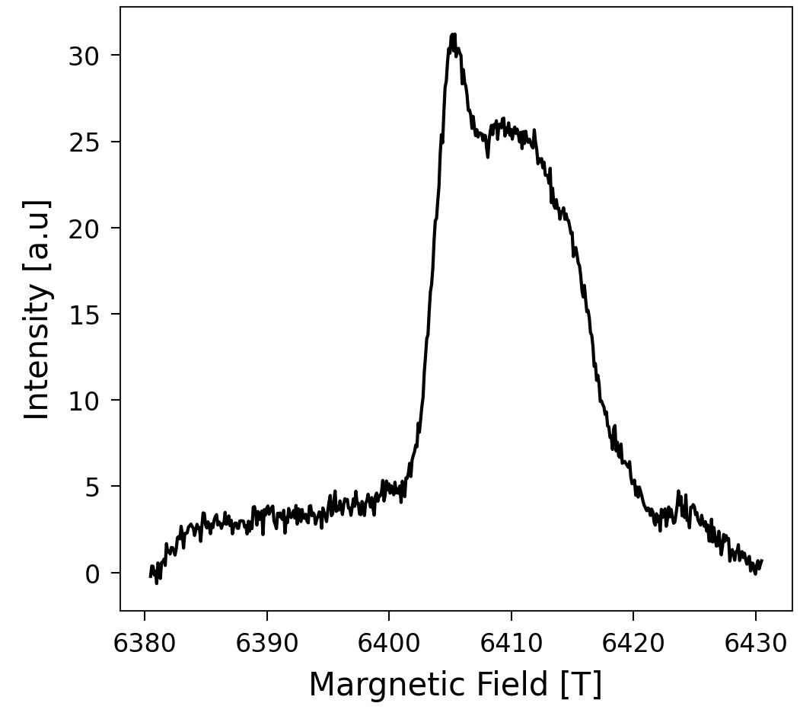
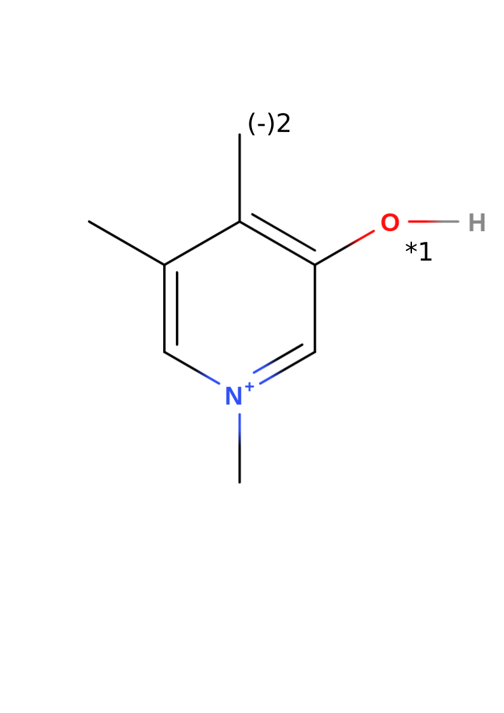
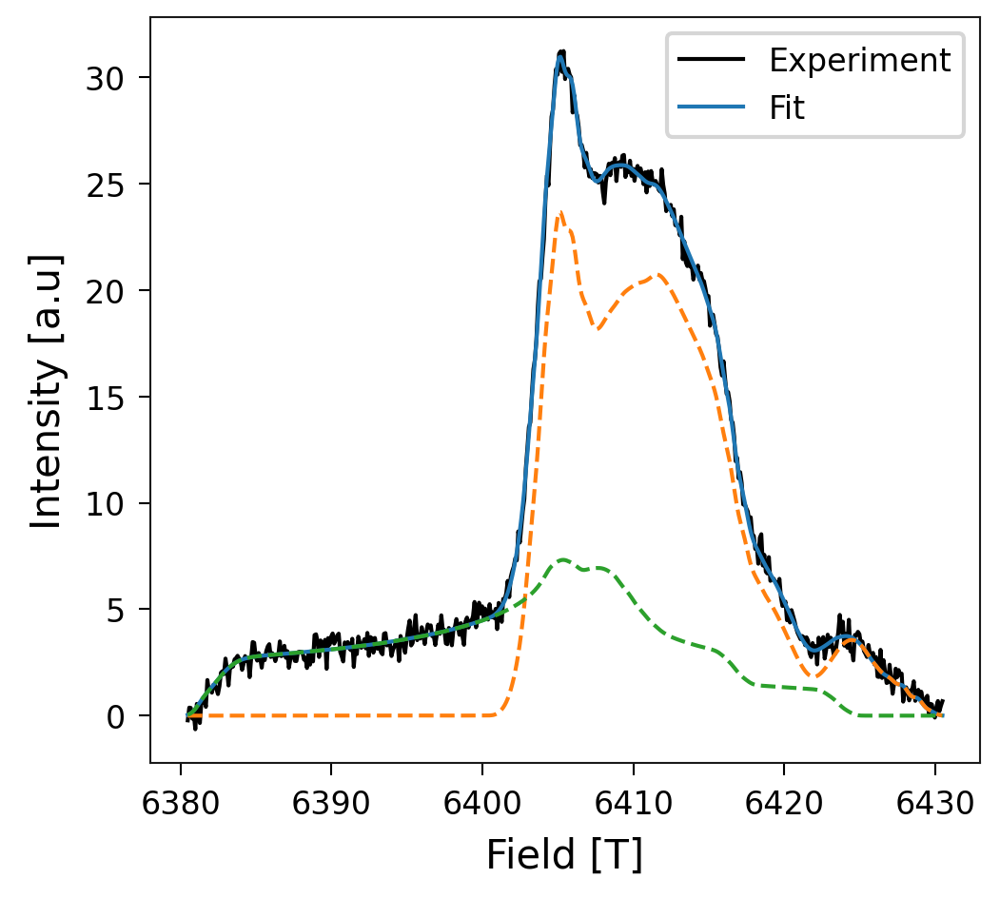

Theoretical EPR spectrum
------------------------

.. attention::

    To use the tools of myutils that are part of this tutorial, be sure that
    Orca is well set up. Check :ref:`orca-setup` for more information.

.. admonition:: For the impatients

    This tutorial builds a whole project, if you only want to compute gvalues
    of a molecule with a radical that you already know, go directly to
    :ref:`Compute the g-values <gval-workflow-tutorial>`.

Suppose that you have an EPR absorption spectrum that you got from a sample of
collagen that looks like this:

In this tutorial, you will learn how to discover from which radicals species
this spectrum comes from, using
`myutils <https://sucerquia.github.io/myutils/>`_. This process is usually done
by finding the best g-values that fit into the experiments by trial-and-error.
Our procedure, in contrast, consists in computing the spectrums of some
candidates that you expect in your sample and finding which ones fit into the
spectrum. With the final fitting, you obtain the concentration of each radical
specie in your sample. In this case, we are going to assume a rupture of
trivalent crosslinks that are shown to be sacrificial bonds according to
`Rennekamp, et al., 2023 <https://www.nature.com/articles/s41467-023-37726-z>`_.

System
======

Consider the radicals in a broken trivalent crosslink, which corresponds to the
next molecule:

Note that the structure of this example without radicals has a total charge +1.
The numbers 1 and 2 in the image represent the two candidates that we are
going to consider in this tutorial. Candidate 1 results from taking out the
hydrogen binded to the oxygen and increasing the multiplicity to 2 (radical).
The Candidate 2 results from deprotonising the methyl group from the first
candidate, which leads to a total change of zero. Note that the second
candidate can also be seen as a radical in the methyl group and a negative
charge in the oxygen; for the DFT calculation, it is exactly the same.

Starting a new project
======================

To use all the advantages of myutils, the files should be located in a certain
way. During the tutorial you are going to build it step by step, but you can
have an idea of the general structure with the next flowchart:

.. mermaid::
   :align: center

    graph TD
    node1["Tutorial"]
      node1 --> node2[&lt;candidate&gt;]
      node2 --> node3[opt]
      node2 --> node4[&lt;i&gt;-&lt;candidate&gt;]
      node1 --> node5[experiments]

In this case, "Tutorial" is the name of the whole project, "candidate" is the
molecule that you use as a base to create the radical candidates and
"<i>-<candidate>" is the i-th radical candidate with the key name that you
choose. For this tutorial, the flowchart would look like this:

.. mermaid::
   :align: center

    graph TD
    node1["CollagenEPR"]
      node1 --> node2["PYD"]
      node2 --> node3[opt]
      node2 --> node4[1-OxygenCharged]
      node2 --> node6[2-OxygenNeutral]
      node1 --> node5[experiments]

Your task now is to create this file structure as follows:

.. code-block:: bash

    mkdir CollagenEPR
    mkdir CollagenEPR/PYD
    mkdir CollagenEPR/PYD/experiments
    mkdir CollagenEPR/PYD/opt
    mkdir CollagenEPR/PYD/1-OxygenCharged
    mkdir CollagenEPR/PYD/2-OxygenNeutral
    
Right at this point you can save your absorption spectrum in "experiments"
directory. You can save as many meassurements as you have. They should be .dat
files with two columns: field and intensity.

Create a Model
==============

To compute radicals, an XYZ file containing the molecular coordinates is
required. You can build it with your favorite tool. I recommend to use
`https://molview.org <https://molview.org/>`_, which allows you to build your
molecule from the structural formula and download the information of the
coordinates.

.. note::

    To transform the .mol file downloaded from MolView into an .xyz file, use

    .. code-block:: bash

        obabel model.mol -O CollagenEPR/PYD/opt/model.xyz

You might want to save an image of your molecular structure because in the end
we are going to summarize our results in a clear and easy way. That image
should also show the label of the candidates as the one image above. Save that
image as :code:`CollagenEPR/PYD/model.png`

Optimize the model
==================

Depending on how you build your molecule, the model could be far from a stable
configuration. Be aware that for computing the g-values of the candidates, we
have to use optimized configurations. An optimization of the initial model
might accelerate the subsequent optimization of the radical species derived
from it. However, if you already have a good structure or if you want to
compute the absorption spectrum of only one radical, you can continue to the
next step by renaming your model as

.. code-block:: bash

    mv CollagenEPR/PYD/opt/model.xyz CollagenEPR/PYD/opt/opt_EPRII.xyz

Otherwise, you have to optimize your structure. You can do that with MyUtils
using

.. code-block:: bash

    $(myutils gval_workflow -path) -c 1 -m 1 -e -v

.. _comment-slurm-bash-tutorial:

.. note::

    gval_workflow is a bash script that contains some variables to set up a
    slurm queue system, which means that you could also use this code to run it
    in a HPC cluster using :code:`sbatch $(myutils gval_workflow -path) ...`.
    To modify those options or add the ones of your queue system, make a copy
    of this file and then submit your job. This can be done with the command
    :code:`cp $(myutils gval_workflow -path) ./<name_of_preference>.sh`. You
    can also use it to understand and modify this code according to your
    preference. If you improve the project, don't hesitate to merge your
    changes to MyUtils

where the flag -e avoids to compute gvalues and HFC in this molecule, which
would not make sense for this case because it does not have any radical.
Use :code:`myutils gval_workflow -h` to check the role of the other flags.

Create radical models
=====================

Use the optimized model to create the radical candidates. You can do that by
removing the hydrogens that cap the radicals' electron structure. One way to do
that is vewing your molecule with your favorite visualization tool (VMol,
PyMol, vmd...) to check the corresponding index of the atom and remove it. Save
the xyz file of a modified molecule in a new directory called
:code:`<n>-<name of candidate>`. In this case, we proceed to create the radical
candidates from :code:`CollagenEPR/PYD/opt/opt_EPRII.xyz`. We only have to know
that the indexes of the hydrogens to be removed are 6 and 16 (starting from 1).
Considering that the xyz format includes two heading lines (a first line with
the number of atoms and a second line for comments), the 6th and 16th atoms
correspond to the 8th and 18th lines respectively. Then, we move to the
directory called "CollagenEPR/PYD" and execute the next commands to remove
those atoms from the optimized molecule: 

.. code-block:: bash

    sed -E "1s/.*/21/ ; 8d" opt/opt_EPRII.xyz > 1-OxygenCharged/model.xyz
    sed -E "1s/.*/20/ ; 18d ; 8d" opt/opt_EPRII.xyz > 2-OxygenNeutral/model.xyz

The resulting molecules should look like the next figure (candidate 1 on the
left, candidate 2 on the right):

.. raw:: html

    

        

            
        

        

            
        

    

.. _gval-workflow-tutorial:

Compute the g-values
====================

Once you have a file :code:`<n>-<name of candidate>/model.xyz` corresponding to
the molecule with each radical, run

.. code-block:: bash

    cd 1-OxygenCharged
    $(myutils gval_workflow -path) -c 1 -f 'g0,4d2' -v
    cd ../2-OxygenNeutral
    $(myutils gval_workflow -path) -c 0 -f 'g0,4,6d2' -v

.. note::

    gval_workflow is a bash script that you can modify. See
    :ref:`last comment <comment-slurm-bash-tutorial>` for more details.

The flag -f indicates which atoms should be included in the hyperfine
calculation. If the argument of this flag starts with g,
:mod:`myutils.g_values.bash_scripts.g_valsetup.HFC_relevantA`
is used to guess the hydrogen atoms around the possible "radical locations". If
you use the guess util, be sure to add the depth of the neighbor. In this case,
for the HFC, we included all the HFC_relevantA atoms in the neighborhood of the
nitrogen, the oxygen and the carbon that can be charged (in candidate 2). For
more information of the guess function and the other flags, use
:code:`myutils gval_workflow -h`.

This workflow does what is explained in the
`ORCA tutorial <https://www.faccts.de/docs/orca/5.0/tutorials/spec/EPR.html>`_
and in
`Zhe Wang's tutorial <https://wongzit.github.io/epr-prediction-with-orca-program/#2-hyperfile-coupling-constant>`_.

.. note::

    gval_workflow also computes frequencies by default. It includes computation
    of thermal properties. In particular, it computes the enthalpy of the
    molecule, which is useful in computation of BDEs. If you want to avoid this
    part, use the flag -b.

Postprocessing
==============

Once your calculations are complete, you can use :code:`myutils gval_postpro` to:

- render each model in a file called opt_EPRII.png
- compute the spectrum obtained theoretically with
  `easyspin <https://www.easyspin.org/>`_.
- plot the gvalues of all the candidates in a file called gvalues.png
- create a table of the gvalues in gvalues_table.md
- create a file called vmd_image.md in each one of the candidate directories.

You just need to move to the master folder and run

.. code-block:: bash

    $(myutils gval_postpro -path) -c PYD/ -e "../../experiment/field_intensity.dat" -f

Summarize your results
======================

With the information obtained from the postprocessing, you can write a proper
README.md file to summarize your results. :code:`myutils gval_template` makes
this analysis quite easy. Copy the source code in your main directory, modify
it as you prefer according to your project. Specially, change those parts that
have :code:`<replace:`. Then, run it and print the outcome in your README.md
file. In this case, we do

.. code-block:: bash

    cp $(myutils gvals_template -path) ./write_readme.sh
    sed -i "s/<replace: name of your candidates>/PYD/g" write_readme.sh
    sed -i "s/<replace: experiment.dat>/field_intensity.dat/g" write_readme.sh
    sed -i "s/<replace: fitting name>/fit2exper1/g" write_readme.sh
    ./write_readme.sh > README.md

and this creates a proper markdown file with the summary of all the results.
Render your project with your tool of preference. Github and gitlab render this
kind of files automatically. Your whole project should look now like the
repository
`github.com/Sucerquia/collagenEPR <https://github.com/Sucerquia/collagenEPR>`_.

.. tip::

    You can transform your README.md into a webpage format using `github Pages
    <https://pages.github.com/>`_.

Fit
===

You will see that in the end of the repository, there is an image of the best
Fitting possible with your candidates. In this case, it should look like this

Also, in the end, you will find a table with the proportion of each one of the
candidates. The outcome of this case is

.. list-table:: 
   :header-rows: 1
   :widths: 30 30
   :align: center

   * - System
     - Percentage
   * - PYD/2-OxygenNeutral
     - 70.03751698946618
   * - PYD/1-OxygenCharged
     - 29.96248301053382

You got a perfect description of your EPR spectrum with the candidates you took
into account! isn't it great? Now, you can use it with your own experimental
data and radical candidates.